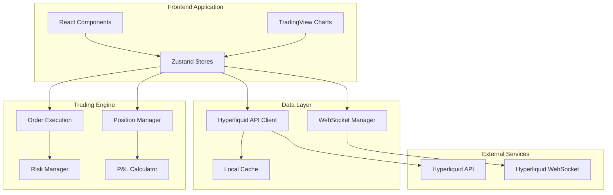

# Trading Simulation Engine - Technical Documentation

## Table of Contents
1. [Executive Summary](#executive-summary)
2. [System Architecture](#system-architecture)
3. [Core Components](#core-components)
4. [Order Execution Engine](#order-execution-engine)
5. [Position Management](#position-management)
6. [Risk Management System](#risk-management-system)
7. [Market Data Integration](#market-data-integration)
8. [Performance Analytics](#performance-analytics)
9. [State Management](#state-management)
10. [API Integration](#api-integration)
11. [Error Handling & Recovery](#error-handling--recovery)
12. [Performance Optimizations](#performance-optimizations)
13. [Testing Strategy](#testing-strategy)
14. [Deployment Guide](#deployment-guide)
15. [Troubleshooting](#troubleshooting)

---

## Executive Summary

The Trading Simulation Engine is a sophisticated paper trading platform built with **Next.js 15**, **TypeScript**, and **React 19**. It provides a realistic trading environment that simulates real market conditions using live data from the Hyperliquid API.

### Key Capabilities
- **Real-time Market Data**: Live price feeds via WebSocket with polling fallback
- **Advanced Order Execution**: Market and limit orders with realistic execution logic
- **Comprehensive Risk Management**: Dynamic position sizing, leverage control, and liquidation monitoring
- **Professional Analytics**: Portfolio performance tracking with Sharpe ratio, drawdown analysis
- **Production-Grade Architecture**: Modular design with proper error handling and performance optimizations

### Technology Stack
```typescript
{
  "framework": "Next.js 15.5.2",
  "language": "TypeScript 5.x",
  "ui": "React 19 + Radix UI + Tailwind CSS 4.x",
  "state": "Zustand 5.x with Immer",
  "charts": "Lightweight Charts 5.x",
  "animations": "Framer Motion 12.x",
  "api": "Hyperliquid REST + WebSocket"
}
```

---

## System Architecture

### High-Level Architecture



### Component Relationships

The system follows a **unidirectional data flow** pattern:

1. **UI Components** dispatch actions to Zustand stores
2. **Stores** contain business logic and coordinate between services  
3. **Services** handle external API calls and data transformation
4. **Trading Engine** processes orders, manages positions, and calculates risk
5. **Market Data** flows from WebSocket → Stores → UI Components

---

## Core Components

### 1. Trading Store (`/src/stores/trading/trading.store.ts`)

The central hub for all trading operations, managing:
- Order placement and execution
- Position lifecycle management  
- Balance tracking and margin calculations
- Risk management integration

```typescript
interface TradingState {
  // Core Data
  balance: Balance;
  positions: Position[];
  orders: Order[];
  transactions: Transaction[];
  
  // Risk Management
  riskManager: RiskManager;
  riskWarnings: RiskWarning[];
  
  // Actions
  placeOrder: (order: OrderData) => Promise<string>;
  closePosition: (positionId: string) => Promise<void>;
  updateBalance: (updates: Partial<Balance>) => void;
}
```

### 2. Market Store (`/src/stores/market/market.store.ts`)

Handles real-time market data:
- Price feed management
- Order book updates
- Historical candle data
- WebSocket subscription coordination

### 3. Portfolio Store (`/src/stores/portfolio/portfolio.store.ts`)

Tracks performance metrics:
- Historical snapshots
- Analytics calculations (Sharpe, drawdown)
- Trade statistics by symbol
- Benchmark comparisons

### 4. Risk Manager (`/src/lib/risk/risk-manager.ts`)

Advanced risk management system:
- Dynamic leverage calculation
- Position sizing recommendations
- Liquidation risk monitoring
- Portfolio exposure limits

---

## Order Execution Engine

### Supported Order Types

#### 1. Market Orders
**Instant execution** at current market price with realistic slippage simulation.

```typescript
// Market Order Execution Flow
const executeMarketOrder = async (order: Order) => {
  // 1. Get current market price
  const priceData = marketStore.getPrice(order.symbol);
  const executionPrice = priceData.price;
  
  // 2. Calculate required margin
  const requiredMargin = calculateRequiredMargin(
    order.size, 
    executionPrice, 
    TRADING_CONFIG.DEFAULT_LEVERAGE
  );
  
  // 3. Validate balance
  if (requiredMargin > balance.available) {
    throw new Error('Insufficient balance');
  }
  
  // 4. Create position
  const position = createPosition({
    symbol: order.symbol,
    side: order.side === 'buy' ? 'long' : 'short',
    size: order.size,
    entryPrice: executionPrice,
    margin: requiredMargin
  });
  
  // 5. Update balances and emit events
  updateBalanceAndEmitEvents(position, order);
};
```

#### 2. Limit Orders
**Conditional execution** when price reaches specified level.

```typescript
// Limit Order Processing (checked on each price update)
const processLimitOrder = (order: Order, currentPrice: number): boolean => {
  if (!order.price) return false;
  
  const shouldFill = 
    (order.side === 'buy' && currentPrice <= order.price) ||
    (order.side === 'sell' && currentPrice >= order.price);
  
  if (shouldFill) {
    executeOrder(order, order.price);
    return true;
  }
  
  return false;
};
```

### Order Validation Pipeline

```typescript
const validateOrder = (order: OrderData): ValidationResult => {
  // 1. Basic validations
  if (order.size <= 0) {
    return { isValid: false, error: 'Order size must be greater than 0' };
  }
  
  // 2. Market price availability
  const priceData = marketStore.getPrice(order.symbol);
  if (!priceData?.price) {
    return { isValid: false, error: 'Market price not available' };
  }
  
  // 3. Balance check
  const executionPrice = order.price || priceData.price;
  const requiredMargin = calculateRequiredMargin(order.size, executionPrice, leverage);
  
  if (requiredMargin > balance.available) {
    return { 
      isValid: false, 
      error: `Insufficient balance. Required: $${requiredMargin}, Available: $${balance.available}` 
    };
  }
  
  // 4. Advanced risk validation
  const riskValidation = riskManager.validateOrderRisk(order, balance, positions);
  if (!riskValidation.isValid) {
    return {
      isValid: false,
      error: riskValidation.warnings[0]?.message || 'Risk limits exceeded',
      riskWarnings: riskValidation.warnings
    };
  }
  
  return { isValid: true };
};
```

---

## Position Management

### Position Lifecycle

```typescript
interface Position {
  id: string;
  symbol: string;
  side: 'long' | 'short';
  size: number;
  
  // Price Tracking
  entryPrice: number;
  currentPrice: number;
  markPrice: number;
  highestPrice: number;
  lowestPrice: number;
  priceHistory: Array<{ price: number; timestamp: number; source: string }>;
  
  // Financial
  margin: number;
  leverage: number;
  pnl: number;
  pnlPercentage: number;
  liquidationPrice?: number;
  
  // Status
  status: 'open' | 'closed';
  timestamp: number;
  lastUpdated: number;
  closedAt?: number;
  closedPrice?: number;
  realizedPnl?: number;
}
```

### Real-time P&L Calculation

The system continuously updates position P&L as market prices change:

```typescript
const refreshPnL = () => {
  const marketStore = useMarketStore.getState();
  let totalUnrealized = 0;
  
  positions.forEach(position => {
    if (position.status === 'open') {
      const priceData = marketStore.getPrice(position.symbol);
      
      if (priceData?.price) {
        // Update price tracking
        position.currentPrice = priceData.price;
        position.highestPrice = Math.max(position.highestPrice, priceData.price);
        position.lowestPrice = Math.min(position.lowestPrice, priceData.price);
        
        // Add to price history (limit to 100 points)
        position.priceHistory.push({
          price: priceData.price,
          timestamp: Date.now(),
          source: 'websocket'
        });
        if (position.priceHistory.length > 100) {
          position.priceHistory.shift();
        }
        
        // Calculate P&L with leverage
        const pnlResult = calculatePnL(
          position.entryPrice,
          priceData.price,
          position.size,
          position.side,
          position.leverage
        );
        
        position.pnl = pnlResult.pnl;
        position.pnlPercentage = pnlResult.pnlPercentage;
        totalUnrealized += pnlResult.pnl;
      }
    }
  });
  
  // Update balance with unrealized P&L
  balance.unrealizedPnl = totalUnrealized;
  balance.freeMargin = balance.available + totalUnrealized;
  balance.marginLevel = balance.margin > 0 
    ? ((balance.total + totalUnrealized) / balance.margin) * 100
    : 0;
};
```

### Position Closing

```typescript
const closePosition = async (positionId: string, size?: number) => {
  const position = positions.find(p => p.id === positionId);
  if (!position || position.status === 'closed') return;
  
  const marketStore = useMarketStore.getState();
  const priceData = marketStore.getPrice(position.symbol);
  const closePrice = priceData?.price || position.currentPrice;
  
  if (size && size < position.size) {
    // Partial close - create new position for remaining size
    const remainingSize = position.size - size;
    const closingSize = size;
    
    // Calculate P&L for closed portion
    const pnl = calculatePnL(
      position.entryPrice,
      closePrice,
      closingSize,
      position.side
    );
    
    // Update position size and margin
    position.size = remainingSize;
    const newMargin = (position.margin * remainingSize) / (remainingSize + closingSize);
    const releasedMargin = position.margin - newMargin;
    position.margin = newMargin;
    
    // Update balance
    balance.available += releasedMargin + pnl.pnl;
    balance.margin -= releasedMargin;
    balance.realizedPnl += pnl.pnl;
  } else {
    // Full close
    const pnl = calculatePnL(
      position.entryPrice,
      closePrice,
      position.size,
      position.side
    );
    
    // Update position
    position.status = 'closed';
    position.closedAt = Date.now();
    position.closedPrice = closePrice;
    position.realizedPnl = pnl.pnl;
    
    // Update balance
    balance.available += position.margin + pnl.pnl;
    balance.margin -= position.margin;
    balance.realizedPnl += pnl.pnl;
    balance.total = TRADING_CONFIG.DEFAULT_BALANCE + balance.realizedPnl;
  }
};
```

---

## Risk Management System

The risk management system provides comprehensive protection against excessive losses through multiple layers of control.

### Risk Limits Configuration

```typescript
interface RiskLimits {
  maxLeverage: number;              // 50x maximum
  maxPositionSize: number;          // 10% of account per position  
  maxTotalExposure: number;         // 50% total portfolio exposure
  maxDailyLoss: number;            // 5% maximum daily loss
  maxOpenPositions: number;        // 10 maximum open positions
  marginCallThreshold: number;     // 80% margin level warning
  liquidationThreshold: number;    // 50% margin level liquidation
}
```

### Dynamic Leverage Calculation

The system calculates optimal leverage based on multiple factors:

```typescript
const calculateDynamicLeverage = (config: DynamicLeverageConfig): number => {
  let adjustedLeverage = config.maxLeverage;
  
  // Volatility adjustment - higher volatility = lower leverage
  const volatilityFactor = Math.max(0.2, 1 - (config.volatility / 100));
  adjustedLeverage *= volatilityFactor;
  
  // Liquidity adjustment - lower liquidity = lower leverage  
  const liquidityFactor = Math.min(1, config.liquidity / 1000000);
  adjustedLeverage *= liquidityFactor;
  
  // User experience adjustment
  const experienceMultiplier = {
    beginner: 0.5,
    intermediate: 0.8,
    expert: 1.0,
  };
  adjustedLeverage *= experienceMultiplier[config.userExperience];
  
  // Account size adjustment - smaller accounts get less leverage
  const accountSizeFactor = Math.min(1, config.accountSize / 100000);
  adjustedLeverage *= Math.max(0.3, accountSizeFactor);
  
  return Math.min(Math.floor(adjustedLeverage), maxLeverage);
};
```

### Risk Warning System

```typescript
interface RiskWarning {
  id: string;
  type: 'margin_call' | 'high_exposure' | 'liquidation_risk' | 'daily_loss' | 'correlation';
  severity: 'low' | 'medium' | 'high' | 'critical';
  message: string;
  recommendation: string;
  timestamp: number;
  positionId?: string;
  symbol?: string;
}
```

### Position Sizing Recommendations

```typescript
const calculatePositionSizing = (
  symbol: string,
  entryPrice: number,
  stopLoss: number,
  balance: Balance,
  riskPercentage: number = 0.02 // 2% risk per trade
): PositionSizingResult => {
  // Calculate risk per unit
  const riskPerUnit = Math.abs(entryPrice - stopLoss);
  
  // Calculate maximum risk amount
  const maxRiskAmount = balance.total * riskPercentage;
  
  // Calculate recommended position size
  const recommendedSize = riskPerUnit > 0 ? maxRiskAmount / riskPerUnit : 0;
  
  // Apply position size limits
  const maxSizeByLimit = (balance.total * riskLimits.maxPositionSize) / entryPrice;
  const maxSize = Math.min(recommendedSize, maxSizeByLimit);
  
  return {
    recommendedSize: Math.floor(recommendedSize * 1000) / 1000,
    maxSize: Math.floor(maxSize * 1000) / 1000,
    riskAmount: recommendedSize * riskPerUnit,
  };
};
```

### Liquidation Risk Monitoring

```typescript
const checkLiquidationRisk = (position: Position): LiquidationRisk => {
  if (!position.liquidationPrice || position.status !== 'open') {
    return {
      isAtRisk: false,
      distanceToLiquidation: Infinity,
      recommendation: 'Position is not at liquidation risk',
    };
  }
  
  const currentPrice = position.currentPrice;
  const distanceToLiquidation = position.side === 'long' 
    ? currentPrice - position.liquidationPrice
    : position.liquidationPrice - currentPrice;
  
  const distancePercentage = Math.abs(distanceToLiquidation / currentPrice) * 100;
  const isAtRisk = distancePercentage < 10; // Within 10% of liquidation
  
  let recommendation = 'Position is safe';
  if (distancePercentage < 5) {
    recommendation = 'URGENT: Add margin or close position immediately';
  } else if (distancePercentage < 10) {
    recommendation = 'WARNING: Consider adding margin or reducing position size';
  } else if (distancePercentage < 20) {
    recommendation = 'Monitor position closely';
  }
  
  return {
    isAtRisk,
    distanceToLiquidation,
    recommendation,
  };
};
```

---

## Market Data Integration

### WebSocket Connection Management

The system maintains reliable real-time connections with graceful fallback to polling:

```typescript
class WebSocketManager {
  private ws: WebSocket | null = null;
  private subscriptions = new Map<string, WebSocketSubscription>();
  private reconnectAttempts = 0;
  private connectionState: ConnectionState;
  
  connect(): Promise<void> {
    return new Promise((resolve, reject) => {
      this.ws = new WebSocket(WS_CONFIG.HYPERLIQUID_WS_URL);
      
      this.ws.onopen = () => {
        console.log('WebSocket connected');
        this.connectionState.connected = true;
        this.connectionState.connecting = false;
        this.reconnectAttempts = 0;
        
        // Resubscribe to all active subscriptions
        this.resubscribeAll();
        resolve();
      };
      
      this.ws.onmessage = (event) => {
        this.handleMessage(JSON.parse(event.data));
      };
      
      this.ws.onclose = () => {
        this.connectionState.connected = false;
        this.handleDisconnection();
      };
      
      this.ws.onerror = (error) => {
        this.connectionState.lastError = error.toString();
        reject(error);
      };
    });
  }
  
  private handleDisconnection(): void {
    if (this.reconnectAttempts < WS_CONFIG.MAX_RECONNECT_ATTEMPTS) {
      const delay = Math.min(
        WS_CONFIG.RECONNECT_DELAY * Math.pow(2, this.reconnectAttempts),
        WS_CONFIG.MAX_RECONNECT_DELAY
      );
      
      setTimeout(() => {
        this.reconnectAttempts++;
        this.connect();
      }, delay);
    } else {
      console.error('Max reconnection attempts reached');
      // Switch to polling mode
      this.startPollingFallback();
    }
  }
}
```

### Real-time Price Updates

```typescript
// WebSocket price update handler
const handlePriceUpdate = (data: any) => {
  if (data.channel === 'allMids') {
    const prices: Record<string, number> = {};
    
    Object.entries(data.data).forEach(([symbol, priceStr]) => {
      prices[symbol] = parseFloat(priceStr as string);
    });
    
    // Update market store
    marketStore.updatePrices(prices);
    
    // Emit events for position updates
    Object.entries(prices).forEach(([symbol, price]) => {
      storeEvents.emit(STORE_EVENTS.PRICE_UPDATE, { symbol, price });
    });
  }
};

// Polling fallback for when WebSocket is unavailable
const startPollingFallback = async () => {
  const pollPrices = async () => {
    try {
      const mids = await hyperliquidAPI.getAllMids();
      const prices: Record<string, number> = {};
      
      Object.entries(mids).forEach(([symbol, priceStr]) => {
        prices[symbol] = parseFloat(priceStr as string);
      });
      
      marketStore.updatePrices(prices);
      
      // Emit price update events
      Object.entries(prices).forEach(([symbol, price]) => {
        storeEvents.emit(STORE_EVENTS.PRICE_UPDATE, { symbol, price });
      });
    } catch (error) {
      console.error('Polling error:', error);
    }
  };
  
  // Poll every 2 seconds
  setInterval(pollPrices, 2000);
};
```

### Chart Data Integration

```typescript
// TradingView Lightweight Charts integration
const TradingChart = ({ symbol, interval = '15m' }) => {
  const { getChartCandles } = useHyperliquidAPI();
  const [chartRef, setCandleSeriesRef] = useState();
  const lastCandleRef = useRef();
  
  // Load historical data
  useEffect(() => {
    const loadData = async () => {
      try {
        const candles = await getChartCandles(symbol, interval);
        
        // Convert to Lightweight Charts format
        const chartCandles = candles.map(candle => ({
          time: Math.floor(candle.t / 1000), // Convert to seconds
          open: parseFloat(candle.o),
          high: parseFloat(candle.h),
          low: parseFloat(candle.l),
          close: parseFloat(candle.c),
          volume: parseFloat(candle.v),
        }));
        
        candleSeriesRef.current.setData(chartCandles);
        lastCandleRef.current = chartCandles[chartCandles.length - 1];
      } catch (error) {
        console.error('Failed to load chart data:', error);
      }
    };
    
    loadData();
  }, [symbol, interval]);
  
  // Real-time price updates
  useEffect(() => {
    const unsubscribe = useMarketStore.subscribe((state) => {
      const price = state.prices.get(symbol);
      if (price && lastCandleRef.current) {
        // Update the current candle with the new price
        const updatedCandle = {
          ...lastCandleRef.current,
          close: price.price,
          high: Math.max(lastCandleRef.current.high, price.price),
          low: Math.min(lastCandleRef.current.low, price.price),
        };
        
        lastCandleRef.current = updatedCandle;
        candleSeriesRef.current?.update(updatedCandle);
      }
    });
    
    return unsubscribe;
  }, [symbol]);
};
```

---

## Performance Analytics

### Portfolio Metrics Calculation

```typescript
interface PortfolioMetrics {
  totalValue: number;
  totalPnL: number;
  totalPnLPercentage: number;
  winRate: number;
  avgWin: number;
  avgLoss: number;
  profitFactor: number;
  sharpeRatio: number;
  maxDrawdown: number;
  currentDrawdown: number;
  totalTrades: number;
  winningTrades: number;
  losingTrades: number;
}
```

### Sharpe Ratio Calculation

```typescript
const calculateSharpeRatio = (period: number = 252): number => {
  const dailyReturns = getDailyReturns();
  if (dailyReturns.length < 2) return 0;
  
  const returns = dailyReturns.map(r => r.return / 100);
  const avgReturn = returns.reduce((sum, r) => sum + r, 0) / returns.length;
  
  const variance = returns.reduce((sum, r) => sum + Math.pow(r - avgReturn, 2), 0) / returns.length;
  const volatility = Math.sqrt(variance);
  
  if (volatility === 0) return 0;
  
  // Annualize the Sharpe ratio
  const annualizedReturn = avgReturn * Math.sqrt(period);
  const annualizedVolatility = volatility * Math.sqrt(period);
  
  // Risk-free rate assumed to be 0 for crypto
  return annualizedReturn / annualizedVolatility;
};
```

### Maximum Drawdown Analysis

```typescript
const calculateMaxDrawdown = (): { maxDrawdown: number; drawdownDuration: number } => {
  const history = performanceHistory;
  if (history.length < 2) return { maxDrawdown: 0, drawdownDuration: 0 };
  
  let maxDrawdown = 0;
  let drawdownDuration = 0;
  let peak = history[0].equity;
  let peakTime = history[0].timestamp;
  let currentDrawdownStart = 0;
  
  for (let i = 1; i < history.length; i++) {
    const current = history[i];
    
    if (current.equity > peak) {
      peak = current.equity;
      peakTime = current.timestamp;
      currentDrawdownStart = 0;
    } else {
      if (currentDrawdownStart === 0) {
        currentDrawdownStart = peakTime;
      }
      
      const drawdown = ((peak - current.equity) / peak) * 100;
      if (drawdown > maxDrawdown) {
        maxDrawdown = drawdown;
        drawdownDuration = current.timestamp - currentDrawdownStart;
      }
    }
  }
  
  return { maxDrawdown, drawdownDuration };
};
```

### Performance Snapshots

```typescript
// Automatic performance tracking
const addPerformanceSnapshot = (manual = false) => {
  const tradingStore = useTradingStore.getState();
  const { balance, positions } = tradingStore;
  
  const timestamp = Date.now();
  const totalPnL = balance.realizedPnl + balance.unrealizedPnl;
  const equity = balance.total + balance.unrealizedPnl;
  
  const snapshot: PerformanceHistory = {
    timestamp,
    balance: balance.total,
    pnl: totalPnL,
    equity,
    positions: positions.filter(p => p.status === 'open').length,
    drawdown: calculateCurrentDrawdown(),
  };
  
  // Add to performance history
  performanceHistory.push(snapshot);
  
  // Keep only last 10,000 snapshots for performance
  if (performanceHistory.length > 10000) {
    performanceHistory = performanceHistory.slice(-10000);
  }
  
  // Add daily snapshot (one per day)
  const dateKey = new Date(timestamp).toISOString().split('T')[0];
  dailySnapshots.set(dateKey, snapshot);
  
  updateMetrics();
};

// Auto-snapshot every 5 minutes
setInterval(() => {
  addPerformanceSnapshot(false);
}, 300000);
```

---

## State Management

The application uses **Zustand** with **Immer** for immutable state updates and **persistence** middleware for data durability.

### Store Architecture

```typescript
// Trading Store with middleware
export const useTradingStore = create<TradingState>()(
  devtools(
    persist(
      immer((set, get) => ({
        // State and actions implementation
      })),
      {
        name: 'trading-store',
        partialize: (state) => ({
          balance: state.balance,
          positions: state.positions,
          orders: state.orders,
          transactions: state.transactions.slice(-500), // Keep last 500
        }),
      }
    ),
    { name: 'trading-store' }
  )
);
```

### Event System

```typescript
// Cross-store communication via events
export const STORE_EVENTS = {
  PRICE_UPDATE: 'price_update',
  ORDER_FILLED: 'order_filled',
  POSITION_OPENED: 'position_opened',
  POSITION_CLOSED: 'position_closed',
  BALANCE_UPDATED: 'balance_updated',
  RISK_WARNING: 'risk_warning',
} as const;

// Event emitter for store coordination
class StoreEventEmitter extends EventTarget {
  emit(eventType: string, data: any) {
    this.dispatchEvent(new CustomEvent(eventType, { detail: data }));
  }
  
  subscribe(eventType: string, callback: (data: any) => void) {
    const handler = (event: CustomEvent) => callback(event.detail);
    this.addEventListener(eventType, handler);
    return () => this.removeEventListener(eventType, handler);
  }
}

export const storeEvents = new StoreEventEmitter();
```

### Performance Optimizations

```typescript
// Batched state updates to reduce re-renders
const batchedUpdates = {
  pending: new Map(),
  timeout: null,
  
  schedule(key: string, updateFn: () => void) {
    this.pending.set(key, updateFn);
    
    if (!this.timeout) {
      this.timeout = setTimeout(() => {
        // Execute all pending updates
        this.pending.forEach(updateFn => updateFn());
        this.pending.clear();
        this.timeout = null;
      }, 100); // 100ms batch window
    }
  }
};

// Throttled price updates
const throttledPriceUpdate = throttle((symbol: string, price: number) => {
  marketStore.updatePrice(symbol, { price });
}, 100); // Max 10 updates per second
```

---

## API Integration

### Hyperliquid API Client

```typescript
class HyperliquidAPIService {
  private baseURL = 'https://api.hyperliquid.xyz';
  private timeout = 10000;
  private lastRequestTime = 0;
  private minRequestInterval = 3000; // Rate limiting
  
  private async request<T>(endpoint: string, payload: Record<string, unknown>): Promise<T> {
    // Rate limiting
    const now = Date.now();
    const timeSinceLastRequest = now - this.lastRequestTime;
    
    if (timeSinceLastRequest < this.minRequestInterval) {
      const waitTime = this.minRequestInterval - timeSinceLastRequest;
      await new Promise(resolve => setTimeout(resolve, waitTime));
    }
    
    this.lastRequestTime = Date.now();
    
    try {
      const response = await fetch(`${this.baseURL}${endpoint}`, {
        method: 'POST',
        headers: { 'Content-Type': 'application/json' },
        body: JSON.stringify(payload),
        signal: AbortSignal.timeout(this.timeout),
      });
      
      if (!response.ok) {
        throw new Error(`HTTP ${response.status}: ${response.statusText}`);
      }
      
      return await response.json() as T;
    } catch (error) {
      console.error(`API request failed for ${endpoint}:`, error);
      throw error;
    }
  }
  
  // Get current market prices
  async getAllMids(): Promise<HyperliquidAllMids> {
    return this.request('/info', { type: 'allMids' });
  }
  
  // Get chart candles with caching
  async getChartCandles(symbol: string, interval: string, startTime?: number): Promise<CandleData[]> {
    const cacheKey = `${symbol}-${interval}-${startTime}`;
    const cached = this.chartDataCache.get(cacheKey);
    
    if (cached && (Date.now() - cached.timestamp) < this.cacheExpiry) {
      return cached.data;
    }
    
    const data = await this.request<HyperliquidCandle[]>('/info', {
      type: 'candleSnapshot',
      req: {
        coin: symbol.split('-')[0], // Convert BTC-USD to BTC
        interval,
        startTime: startTime || Date.now() - (7 * 24 * 60 * 60 * 1000), // 7 days default
      },
    });
    
    const chartCandles = data.map(candle => ({
      time: Math.floor(candle.t / 1000),
      open: parseFloat(candle.o),
      high: parseFloat(candle.h),
      low: parseFloat(candle.l),
      close: parseFloat(candle.c),
      volume: parseFloat(candle.v),
    }));
    
    // Cache result
    this.chartDataCache.set(cacheKey, {
      data: chartCandles,
      timestamp: Date.now()
    });
    
    return chartCandles;
  }
}
```

### Error Handling

```typescript
// Comprehensive error handling with retry logic
const withRetry = async <T>(
  operation: () => Promise<T>,
  maxAttempts: number = 3,
  delay: number = 1000
): Promise<T> => {
  let lastError: Error;
  
  for (let attempt = 1; attempt <= maxAttempts; attempt++) {
    try {
      return await operation();
    } catch (error) {
      lastError = error as Error;
      
      if (attempt === maxAttempts) {
        throw lastError;
      }
      
      // Exponential backoff
      const waitTime = delay * Math.pow(2, attempt - 1);
      await new Promise(resolve => setTimeout(resolve, waitTime));
    }
  }
  
  throw lastError!;
};

// Circuit breaker pattern for API calls
class CircuitBreaker {
  private failures = 0;
  private lastFailureTime = 0;
  private state: 'closed' | 'open' | 'half-open' = 'closed';
  
  constructor(
    private threshold: number = 5,
    private timeout: number = 60000 // 1 minute
  ) {}
  
  async execute<T>(operation: () => Promise<T>): Promise<T> {
    if (this.state === 'open') {
      if (Date.now() - this.lastFailureTime < this.timeout) {
        throw new Error('Circuit breaker is OPEN');
      } else {
        this.state = 'half-open';
      }
    }
    
    try {
      const result = await operation();
      this.onSuccess();
      return result;
    } catch (error) {
      this.onFailure();
      throw error;
    }
  }
  
  private onSuccess() {
    this.failures = 0;
    this.state = 'closed';
  }
  
  private onFailure() {
    this.failures++;
    this.lastFailureTime = Date.now();
    
    if (this.failures >= this.threshold) {
      this.state = 'open';
    }
  }
}
```

---

## Error Handling & Recovery

### Error Classification

```typescript
interface AppError {
  code: string;
  message: string;
  details?: unknown;
  timestamp: number;
  recoverable?: boolean;
}

// Error types
enum ErrorCode {
  NETWORK_ERROR = 'NETWORK_ERROR',
  API_ERROR = 'API_ERROR', 
  VALIDATION_ERROR = 'VALIDATION_ERROR',
  WEBSOCKET_ERROR = 'WEBSOCKET_ERROR',
  INSUFFICIENT_BALANCE = 'INSUFFICIENT_BALANCE',
  RATE_LIMIT_EXCEEDED = 'RATE_LIMIT_EXCEEDED',
  UNKNOWN_ERROR = 'UNKNOWN_ERROR'
}
```

### Global Error Handler

```typescript
// React Error Boundary
class TradingErrorBoundary extends React.Component<Props, State> {
  constructor(props: Props) {
    super(props);
    this.state = { hasError: false, error: null };
  }
  
  static getDerivedStateFromError(error: Error): State {
    return {
      hasError: true,
      error: {
        code: ErrorCode.UNKNOWN_ERROR,
        message: error.message,
        details: error.stack,
        timestamp: Date.now(),
      }
    };
  }
  
  componentDidCatch(error: Error, errorInfo: ErrorInfo) {
    // Log error to external service
    console.error('Trading Engine Error:', error, errorInfo);
    
    // Try to recover based on error type
    this.attemptRecovery(error);
  }
  
  private attemptRecovery(error: Error) {
    // WebSocket disconnection
    if (error.message.includes('WebSocket')) {
      // Switch to polling mode
      this.switchToPollingMode();
    }
    
    // API rate limit
    if (error.message.includes('rate limit')) {
      // Implement exponential backoff
      this.implementBackoff();
    }
  }
}
```

### Graceful Degradation

```typescript
// Fallback mechanisms
const TradingInterface = () => {
  const [connectionMode, setConnectionMode] = useState<'websocket' | 'polling'>('websocket');
  const [isOnline, setIsOnline] = useState(navigator.onLine);
  
  // Monitor network status
  useEffect(() => {
    const handleOnline = () => setIsOnline(true);
    const handleOffline = () => setIsOnline(false);
    
    window.addEventListener('online', handleOnline);
    window.addEventListener('offline', handleOffline);
    
    return () => {
      window.removeEventListener('online', handleOnline);
      window.removeEventListener('offline', handleOffline);
    };
  }, []);
  
  // Switch to polling when offline
  useEffect(() => {
    if (!isOnline && connectionMode === 'websocket') {
      setConnectionMode('polling');
      showNotification({
        type: 'warning',
        title: 'Connection Lost',
        message: 'Switched to polling mode for price updates',
      });
    } else if (isOnline && connectionMode === 'polling') {
      setConnectionMode('websocket');
      showNotification({
        type: 'success',
        title: 'Connection Restored',
        message: 'Real-time updates resumed',
      });
    }
  }, [isOnline, connectionMode]);
};
```

---

## Performance Optimizations

### Virtual Scrolling for Large Lists

```typescript
// Virtual list for asset selection
import { FixedSizeList as List } from 'react-window';

const AssetList = ({ assets }: { assets: Asset[] }) => {
  const itemSize = 72; // Height of each item in pixels
  const containerHeight = 400; // Container height
  
  const Row = ({ index, style }: { index: number; style: React.CSSProperties }) => {
    const asset = assets[index];
    
    return (
      <div style={style}>
        <AssetListItem asset={asset} />
      </div>
    );
  };
  
  return (
    <List
      height={containerHeight}
      itemCount={assets.length}
      itemSize={itemSize}
      overscanCount={5} // Render 5 extra items for smooth scrolling
    >
      {Row}
    </List>
  );
};
```

### Memoization and React Optimizations

```typescript
// Memoized components for performance
const TradingPanel = React.memo(({ symbol }: { symbol: string }) => {
  const { balance, placeOrder } = useTradingStore();
  const price = useMarketStore(state => state.prices.get(symbol));
  
  // Memoize expensive calculations
  const maxOrderSize = useMemo(() => {
    if (!price) return 0;
    return balance.available / price.price;
  }, [balance.available, price?.price]);
  
  // Debounce user input
  const debouncedOrderSize = useDebounce(orderSize, 300);
  
  return (
    <div className="trading-panel">
      {/* Trading form */}
    </div>
  );
});

// Custom hook for debouncing
const useDebounce = <T>(value: T, delay: number): T => {
  const [debouncedValue, setDebouncedValue] = useState<T>(value);
  
  useEffect(() => {
    const handler = setTimeout(() => {
      setDebouncedValue(value);
    }, delay);
    
    return () => {
      clearTimeout(handler);
    };
  }, [value, delay]);
  
  return debouncedValue;
};
```

### Memory Management

```typescript
// Automatic cleanup of old data
class DataRetentionManager {
  private static readonly MAX_PRICE_HISTORY = 100;
  private static readonly MAX_TRANSACTIONS = 500;
  private static readonly MAX_PERFORMANCE_SNAPSHOTS = 1000;
  
  static cleanupPositionHistory(position: Position): Position {
    if (position.priceHistory && position.priceHistory.length > this.MAX_PRICE_HISTORY) {
      position.priceHistory = position.priceHistory.slice(-this.MAX_PRICE_HISTORY);
    }
    return position;
  }
  
  static cleanupTransactions(transactions: Transaction[]): Transaction[] {
    if (transactions.length > this.MAX_TRANSACTIONS) {
      return transactions.slice(-this.MAX_TRANSACTIONS);
    }
    return transactions;
  }
  
  static cleanupPerformanceHistory(history: PerformanceHistory[]): PerformanceHistory[] {
    if (history.length > this.MAX_PERFORMANCE_SNAPSHOTS) {
      return history.slice(-this.MAX_PERFORMANCE_SNAPSHOTS);
    }
    return history;
  }
}

// Periodic cleanup
setInterval(() => {
  const tradingStore = useTradingStore.getState();
  
  // Clean up position price histories
  tradingStore.positions.forEach(position => {
    DataRetentionManager.cleanupPositionHistory(position);
  });
  
  // Clean up old transactions
  const cleanTransactions = DataRetentionManager.cleanupTransactions(tradingStore.transactions);
  if (cleanTransactions.length !== tradingStore.transactions.length) {
    tradingStore.updateTransactions(cleanTransactions);
  }
}, 60000); // Clean every minute
```

### Bundle Optimization

```typescript
// Code splitting for better performance
const TradingChart = lazy(() => import('./components/chart/TradingChart'));
const PortfolioDashboard = lazy(() => import('./components/analytics/PortfolioDashboard'));
const RiskManager = lazy(() => import('./components/risk/RiskManager'));

// Lazy loading with Suspense
const App = () => (
  <Router>
    <Routes>
      <Route path="/trading" element={
        <Suspense fallback={<ChartSkeleton />}>
          <TradingChart />
        </Suspense>
      } />
      <Route path="/portfolio" element={
        <Suspense fallback={<PortfolioSkeleton />}>
          <PortfolioDashboard />
        </Suspense>
      } />
    </Routes>
  </Router>
);
```

---

## Testing Strategy

### Unit Tests

```typescript
// Trading store unit tests
describe('Trading Store', () => {
  let store: ReturnType<typeof useTradingStore.getState>;
  
  beforeEach(() => {
    store = useTradingStore.getState();
    store.reset(); // Reset to initial state
  });
  
  describe('Order Placement', () => {
    it('should place a market order successfully', async () => {
      // Mock market price
      const mockPrice = { price: 50000, timestamp: Date.now() };
      useMarketStore.getState().updatePrice('BTC', mockPrice);
      
      const orderData = {
        symbol: 'BTC',
        type: 'market' as const,
        side: 'buy' as const,
        size: 0.001,
      };
      
      const orderId = await store.placeOrder(orderData);
      
      expect(orderId).toBeDefined();
      expect(store.orders).toHaveLength(1);
      expect(store.positions).toHaveLength(1);
      expect(store.orders[0].status).toBe('filled');
    });
    
    it('should reject order with insufficient balance', async () => {
      const orderData = {
        symbol: 'BTC',
        type: 'market' as const,
        side: 'buy' as const,
        size: 10, // Requires more than available balance
      };
      
      await expect(store.placeOrder(orderData)).rejects.toThrow('Insufficient balance');
    });
  });
  
  describe('Position Management', () => {
    it('should calculate P&L correctly', () => {
      const position = {
        entryPrice: 50000,
        currentPrice: 55000,
        size: 0.001,
        side: 'long' as const,
      };
      
      const pnl = calculatePnL(
        position.entryPrice,
        position.currentPrice,
        position.size,
        position.side
      );
      
      expect(pnl.pnl).toBe(5); // (55000 - 50000) * 0.001 = 5
      expect(pnl.pnlPercentage).toBe(10); // 5000/50000 * 100 = 10%
    });
  });
});
```

### Integration Tests

```typescript
// API integration tests
describe('Hyperliquid API Integration', () => {
  let apiClient: HyperliquidAPIService;
  
  beforeEach(() => {
    apiClient = new HyperliquidAPIService();
  });
  
  it('should fetch current prices', async () => {
    const prices = await apiClient.getAllMids();
    
    expect(prices).toBeDefined();
    expect(typeof prices.BTC).toBe('string');
    expect(parseFloat(prices.BTC)).toBeGreaterThan(0);
  });
  
  it('should handle API errors gracefully', async () => {
    // Mock network failure
    global.fetch = jest.fn().mockRejectedValue(new Error('Network error'));
    
    await expect(apiClient.getAllMids()).rejects.toThrow('Network error');
  });
});
```

### E2E Tests

```typescript
// Cypress E2E tests
describe('Trading Flow', () => {
  it('should complete full trading cycle', () => {
    cy.visit('/');
    
    // Select an asset
    cy.get('[data-testid="asset-selector"]').click();
    cy.get('[data-testid="asset-BTC"]').click();
    
    // Place a market order
    cy.get('[data-testid="order-size"]').type('0.001');
    cy.get('[data-testid="buy-button"]').click();
    
    // Verify order was placed
    cy.get('[data-testid="order-success"]').should('be.visible');
    cy.get('[data-testid="positions-list"]').should('contain', 'BTC');
    
    // Close position
    cy.get('[data-testid="close-position"]').click();
    cy.get('[data-testid="confirm-close"]').click();
    
    // Verify position was closed
    cy.get('[data-testid="position-closed"]').should('be.visible');
  });
});
```

---

## Deployment Guide

### Production Build

```bash
# Build for production
npm run build

# Analyze bundle size
npm install -g @next/bundle-analyzer
ANALYZE=true npm run build

# Run production server
npm start
```

### Environment Configuration

```typescript
// next.config.ts
const nextConfig = {
  env: {
    HYPERLIQUID_API_URL: process.env.HYPERLIQUID_API_URL || 'https://api.hyperliquid.xyz',
    HYPERLIQUID_WS_URL: process.env.HYPERLIQUID_WS_URL || 'wss://api.hyperliquid.xyz/ws',
  },
  
  // Performance optimizations
  experimental: {
    turbo: {
      loaders: {
        '.svg': ['@svgr/webpack'],
      },
    },
  },
  
  // Bundle optimization
  webpack: (config, { isServer }) => {
    if (!isServer) {
      config.resolve.fallback = {
        fs: false,
        net: false,
        tls: false,
      };
    }
    return config;
  },
};
```

### Monitoring and Logging

```typescript
// Error tracking
class ErrorTracker {
  static track(error: Error, context?: any) {
    console.error('Error tracked:', error, context);
    
    // In production, send to error tracking service
    if (process.env.NODE_ENV === 'production') {
      // Sentry, LogRocket, etc.
      this.sendToErrorService(error, context);
    }
  }
  
  private static sendToErrorService(error: Error, context?: any) {
    // Implementation for error tracking service
  }
}

// Performance monitoring
class PerformanceMonitor {
  static measureApiCall<T>(operation: () => Promise<T>, endpoint: string): Promise<T> {
    const start = performance.now();
    
    return operation()
      .then(result => {
        const duration = performance.now() - start;
        this.logMetric('api_call_duration', duration, { endpoint });
        return result;
      })
      .catch(error => {
        const duration = performance.now() - start;
        this.logMetric('api_call_error', duration, { endpoint, error: error.message });
        throw error;
      });
  }
  
  private static logMetric(name: string, value: number, tags?: any) {
    console.log(`Metric: ${name}`, value, tags);
    
    // In production, send to monitoring service
    if (process.env.NODE_ENV === 'production') {
      // DataDog, New Relic, etc.
    }
  }
}
```

---

## Troubleshooting

### Common Issues

#### 1. WebSocket Connection Failures

**Symptoms**: Real-time data not updating, connection status shows "Offline"

**Solutions**:
- Check network connectivity
- Verify WebSocket URL is accessible
- Clear browser cache and localStorage
- System automatically falls back to polling mode

```typescript
// Debug WebSocket issues
const debugWebSocket = () => {
  const wsManager = useWebSocketStore.getState();
  
  console.log('WebSocket Debug Info:', {
    connected: wsManager.connected,
    reconnectAttempts: wsManager.reconnectAttempts,
    subscriptions: Array.from(wsManager.subscriptions.keys()),
    lastError: wsManager.lastError,
  });
};
```

#### 2. Order Execution Issues

**Symptoms**: Orders remain pending, execution fails

**Solutions**:
- Verify market price is available
- Check account balance
- Review risk management limits
- Ensure order parameters are valid

```typescript
// Debug order issues
const debugOrder = (orderData: OrderData) => {
  const tradingStore = useTradingStore.getState();
  const marketStore = useMarketStore.getState();
  
  console.log('Order Debug Info:', {
    orderData,
    balance: tradingStore.balance,
    marketPrice: marketStore.getPrice(orderData.symbol),
    riskWarnings: tradingStore.riskWarnings,
  });
  
  // Validate order
  const validation = tradingStore.validateOrder(orderData);
  console.log('Order Validation:', validation);
};
```

#### 3. Performance Issues

**Symptoms**: Slow rendering, memory usage growth

**Solutions**:
- Check browser DevTools Performance tab
- Monitor memory usage in Task Manager
- Clear old data periodically
- Reduce update frequency if needed

```typescript
// Performance monitoring
const monitorPerformance = () => {
  const measureMemory = () => {
    if ('memory' in performance) {
      console.log('Memory Usage:', {
        used: Math.round(performance.memory.usedJSHeapSize / 1048576) + ' MB',
        total: Math.round(performance.memory.totalJSHeapSize / 1048576) + ' MB',
        limit: Math.round(performance.memory.jsHeapSizeLimit / 1048576) + ' MB',
      });
    }
  };
  
  setInterval(measureMemory, 30000); // Check every 30 seconds
};
```

#### 4. State Persistence Issues

**Symptoms**: Data lost on refresh, inconsistent state

**Solutions**:
- Check localStorage availability
- Verify JSON serialization works
- Clear corrupted localStorage data
- Check browser storage limits

```typescript
// Debug state persistence
const debugPersistence = () => {
  try {
    const tradingData = localStorage.getItem('trading-store');
    const portfolioData = localStorage.getItem('portfolio-store');
    
    console.log('Persisted Data:', {
      tradingSize: tradingData?.length || 0,
      portfolioSize: portfolioData?.length || 0,
      canParseTroding: tradingData ? JSON.parse(tradingData) : null,
      canParsePortfolio: portfolioData ? JSON.parse(portfolioData) : null,
    });
  } catch (error) {
    console.error('Persistence Debug Error:', error);
    
    // Clear corrupted data
    localStorage.removeItem('trading-store');
    localStorage.removeItem('portfolio-store');
  }
};
```

### Recovery Procedures

#### Reset Application State

```typescript
const resetApplication = () => {
  // Clear all stores
  useTradingStore.getState().reset();
  usePortfolioStore.getState().reset();
  useMarketStore.getState().reset();
  
  // Clear localStorage
  Object.values(STORAGE_KEYS).forEach(key => {
    localStorage.removeItem(key);
  });
  
  // Reload page
  window.location.reload();
};
```

#### Emergency Position Closure

```typescript
const emergencyCloseAllPositions = async () => {
  const tradingStore = useTradingStore.getState();
  const openPositions = tradingStore.getOpenPositions();
  
  console.log(`Closing ${openPositions.length} positions...`);
  
  for (const position of openPositions) {
    try {
      await tradingStore.closePosition(position.id);
      console.log(`Closed position ${position.id} for ${position.symbol}`);
    } catch (error) {
      console.error(`Failed to close position ${position.id}:`, error);
    }
  }
  
  console.log('Emergency closure complete');
};
```

---

## Conclusion

The Trading Simulation Engine represents a comprehensive, production-ready paper trading platform that demonstrates advanced frontend development skills and deep understanding of trading systems. The architecture emphasizes:

- **Reliability**: Robust error handling and graceful degradation
- **Performance**: Optimized for real-time updates and large datasets  
- **Scalability**: Modular design that can accommodate new features
- **User Experience**: Professional interface with smooth interactions
- **Maintainability**: Clean code with comprehensive documentation

This documentation serves as both a technical reference and a guide for extending the system with additional trading features and market integrations.

---

*Last updated: December 2024*
*Version: 1.0.0*